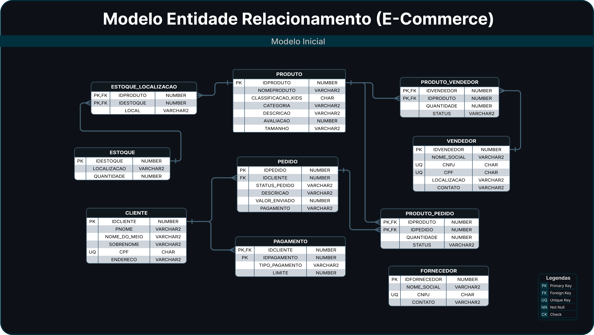
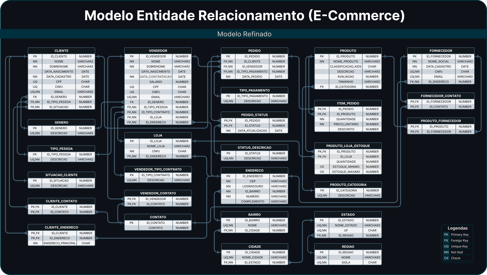

# 🚧 Projeto em Desenvolvimento

Este repositório faz parte de um desafio de projeto do bootcamp DIO.
No momento estou sem acesso a um computador, portanto a implementação será adicionada em breve.

Agradeço pela compreensão! 🙌

--------------

# 🛒 Projeto de Banco de Dados E-commerce (Oracle SQL)

## 📚 Contexto

Este projeto foi desenvolvido como parte de um desafio prático do Bootcamp de Analise de Dados da Digital Innovation One (DIO).

## 📈 Objetivo do Projeto
- Demonstrar habilidades em **modelagem de banco de dados relacional**.  
- Aplicar **conceitos de normalização** e boas práticas de design.  
- Simular um ambiente real de **sistema de e-commerce**, com pedidos, produtos, clientes, fornecedores e estoques.

---

## 📂 Estrutura do Repositório

O repositório contém tanto o **modelo inicial** quanto a **versão refinada**, evidenciando o processo de normalização, refinamento de entidades e otimização das relações.

---

| Pasta | Descrição |
|--------|------------|
| `/modelo_inicial` | Contém o modelo e script SQL da versão inicial do banco de dados |
| `/modelo_refinado` | Contém o modelo refinado, script atualizado e changelog de alterações |
| `README.md` | Documentação principal do projeto |

---

## ⚙️ Tecnologias Utilizadas

|Categoria | Tecnologia - Ferramenta |
| -------- | --------|
| SGBD (Banco de Dados) | Oracle Database (em container Docker) |
| Ambiente de Desenvolvimento| DBeaver|
| Modelagem de Dados (MER)|Lucidchart |
|Linguagem SQL | Oracle SQL (DDL e DML)|
|Containerização|Docker |

---

## 🧱 Modelo Inicial

A primeira versão do modelo de banco de dados contém as principais entidades de um e-commerce, como **Cliente**, **Produto**, **Pedido** e **Pagamento**, além das relações básicas entre elas.

**Diagrama:**

📄 **Script SQL:**
[`modelo_inicial/create_tables.sql`](modelo_inicial/01_create_tables.sql)

---

## 🚀 Modelo Refinado

A versão refinada do modelo introduz melhorias de estrutura e normalização, permitindo maior flexibilidade e consistência dos dados.

**Diagrama:**

📄 **Script SQL:**
[`modelo_refinado/create_tables.sql`](modelo_refinado/01_create_tables.sql)

📜 **changelog (alterações_detalhadas):**
['modelo_refinado/changelog'](modelo_refinado/changelog.md)

---

## 🧩 Principais Melhorias Implementadas
- Criação de tabelas auxiliares para controle de **categorias, status e pagamentos**.
- Introdução da tabela **ENDERECO**, centralizando os dados de localização.
- Resolução de relacionamentos **N:N** por meio de tabelas intermediárias.
- Substituição de atributos diretos por **chaves estrangeiras** (FKs).
- Melhoria na integridade referencial e modularidade das entidades.

---

## 👨‍💻 Autor
Alexis Pereira
📧 E-mail: alexispereira220@gmail.com
